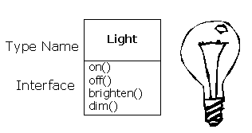

## 1.2 每个对象都有一个接口

- 即任何程序都是你所设计的系统的一种仿真，面向对象技术的应用确实可以将大量的问题很容易地降解为一个简单的解决方案

- 一旦类被建立，就可以随心所欲地创建类的任意个对象，然后去操作它们，就像它们是存在于你的待求解问题中的元素一样。事实上，面向对象程序设计的挑战之一

- 每个对象都只能满足某些请求，这些请求由对象的接口（interface）所定义，决定接口的接口便是类型。以电灯泡为例来做一个简单的比喻（如右图所示）：



```java
// Light.java对象
class Light {
    int state;
    void on() {
        state = 1;
        System.out.println("Light on");
    }
    void off() {
        state = 2;
        System.out.println("Light off");
    }
    void  brighten() {
        state = 3;
        System.out.println("Light brighten");
    }
    void  dim() {
        state = 4;
        System.out.println("Light dim");
    }
}

// 调用
Light lt = new Light();
lt.on();
```

-  **接口确定了对某一特定对象所能发出的请求**。但是，在程序中必须有满足这些请求的代码。这些代码与隐藏的数据一起构成了实现。从过程型编程的观点来看，这并不太复杂。在类型中，每一个可能的请求都有一个方法与之相关联，当向对象发送请求时，与之相关联的方法就会被调用。此过程通常被概括为：向某个对象“发送消息”（产生请求），这个对象便知道此消息的目的，然后执行对应的程序代码。

- 上例中，类型／类的名称是`Light`，特定的`Light`对象的名称是`lt`，可以向`Light`对象发出的请求是：打开它、关闭它、将它调亮、将它调暗。你以下列方式创建了一个`Light`对象：定义这个对象的“引用”（`It`），然后调用`new`方法来创建该类型的新对象。为了向对象发送消息，需要声明对象的名称，并以圆点符号连接一个消息请求。从预定义类的用户观点来看，这些差不多就是用对象来进行设计的全部。


### 小结
- 接口是对象能够响应的请求的集合
- 对象的接口只能由对象的类来决定
- 多态性是指相同的消息可以被不同类型的对象所响应
- 继承允许将多个类型进行组合成为一个更一般的类型
- 组合允许动态地将多个类型组合成为一个更一般的类型