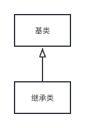

## 1.6 继承

- 以现有的类为基础，复制它，然后通过添加和修改这个副本来创建新类那就要好多了。通过继承便可以达到这样的效果，不过也有例外，当源类（被称为基类、超类或父类）发基类生变动时，被修改的〝副本”（被称为导出奏、然承类或子奏） 也会反映出这些变动（如下图所示)。



（这张UML图中的箭头从导出类指向基类，就像稍后你会看到的，通常会存在一个以上的导出类。）


- 经典的几何形的例子，这在计算机辅助设计系统或游戏仿真系统中可能被用到。基类是几何形，每一个几何形都具有尺寸、颜色、位置等，同时每一个几何形都可以被绘制、擦除、移动和者色等。在此基础上，可以导出（继承出）具体的几何形状一一圆形、正方形、三角形等一每一种都具有额外的特性和行为，例如某些形状可以被翻转。某些行为可能并不相同，例如计算几何形状的面积。类型层次结构同时体现了几何形状之间的相似性和差异性


*
- 由于基类和导出类具有相同的基础接口，所以伴随此接口的必定有某些具体实现。也就是说，当对象接收到特定消息时，必须有某些代码去执行。如果只是简单地继承一个类而并不做其他任何事，那么在基类接口中的方法將会直接继承到导出类中。这意味着导出类的对象不仅与基类拥有相同的类型，而且还拥有相同的行为，这样做没有什么特別意义。

- 有两种方法可以使基类与导出类产生差异。第一种方法非常直接：直接在导出类中添加新方法。这些新方法并不是基类接口的一部分。这意味蒼基类不能直接满足你的所有需求，因此必需添加更多的方法。这种对继永简单而基本的使用方式，有时对问题来说确实是一种完美的解決方式。但是，应该仔细考感是否存在基类也需要这些额外方法的可能性。这种设计的发现与迭代过程在面向对象程序
设计中会经常发生（如下代码)。


```java
// 在导出类中添加新方法
// 形状
public class Shape {
    void draw() {
        System.out.println("Shape draw");
    }
    void erase() {
        System.out.println("Shape erase");
    }
    void move() {
        System.out.println("Shape move");
    }
    void getColor() {
        System.out.println("Shape getColor");
    }
    void setColor() {
        System.out.println("Shape setColor");
    }
    // 圆形
    class Circle extends Shape{

    }
    // 正方形
    class Square extends Shape{

    }
    // 三角形
    class Triangle extends Shape{
        void flipvertical() {
            System.out.println("Triangle flipvertical");
        }
        void flipHorizontal() {
            System.out.println("Triangle flipHorizontal");
        }
    }
}
```

- 虽然继承有时可能意味着在接口中添加新方法（尤其是在以extends关键字表示继承的Java中），但并非总需如此。第二种也是更重要的一种使导出类和基类之间产生差异的方法是改变现有基类的方法的行为，这被称之为覆盖 (overriding）那个方法（如下代码)。

```java
// 覆盖父类方法
// 形状
public class Shape {
    void draw() {
        System.out.println("Shape draw");
    }
    void erase() {
        System.out.println("Shape erase");
    }
    void move() {
        System.out.println("Shape move");
    }
    void getColor() {
        System.out.println("Shape getColor");
    }
    void setColor() {
        System.out.println("Shape setColor");
    }
    // 圆形
    class Circle extends Shape{
        void draw() {
            System.out.println("Circle draw");
        }
        void erase() {
            System.out.println("Circle erase");
        }
    }
    // 正方形
    class Square extends Shape{
        void draw() {
            System.out.println("Circle draw");
        }
        void erase() {
            System.out.println("Circle erase");
        }
    }
    // 三角形
    class Triangle extends Shape{
        void draw() {
            System.out.println("Circle draw");
        }
        void erase() {
            System.out.println("Circle erase");
        }
    }
}
```

### 小结
- 在组合与继承之间选择：“is-a”（是一个）的关系用继承来表达，“has-a”（有一个）的关系用组合来表达。
- is-a 和 is-like-a 在实际开发中都很常见
- 继承是一种强大的代码复用方式，但是它也有一些缺点。其中最大的缺点是，它将基类与导出类的耦合度增加到了最高级，而这会影响代码的灵活性和可维护性。如果某个基类发生了变化，那么必须仔细检查所有的导出类，以确保它们仍然能够正确地工作。如果在基类中添加了一个新方法，那么所有的导出类都必须提供这个方法的定义。这意味着，如果你编写了一个库，并且希望其他人使用它，那么就必须非常小心地修改这个库，以确保不会破坏现有的代码。这也是为什么在Java中，如果你没有特别指定，那么所有的方法都会被继承的原因。这样做可以确保库的设计者可以在不破坏现有代码的情况下，向库中添加新的方法。但是，如果你不是在编写一个库，而是在编写一个应用程序，那么这种方式就会使得代码变得混乱不堪。因此，你应该尽可能地将所有的数据都隐藏起来，以便于维护和修改。


