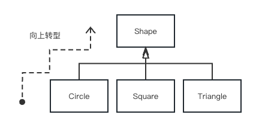

## 1.7 伴随多态的可互换对象

- 在处理类型的层次结构时，经常想把一个对象不当作它所属的特定类型来对待，而是将其当作其基类的对象来对待。这使得人们可以编写出不依赖于特定类型的代码。在“几何形”的例子中，方法操作的都是记化(`generic`）的形状，而不关心它们是國形、正方形、三角形还是其他什么尚未定义的形状。所有的几何形状都可以被绘制、擦除和移动，`所以这些方法都是直接对一个几何形对象发送消息：它们不用担心对象将如何处理消息。`

- **面向对象程序设计语言使用了后期绑定的概念**。`当向对象发送消息时，被调用的代码直到运行时才能确定`。编译器确保被调用方法的存在，并对调用参数和返回值执行类型检查（无法提供此类保证的语言被称为是弱类型的），但是并不知道将被执行的确切代码。


### 再来看看几何形状的例子
整个类族 （其中所有的类都基于相同的一致接口）在本章前面已有图示。为了说明多态，我们要编写一段代码，它忽路类型的具体细节，仅仅和基类交互。这段代码和具体类型信息是`分离的(decoupled)`，这样做使代码编写更为简单，也更易于理解。而且，`如果通过继承机制添加一个新类型，例如Hexagon（六边形），所编写的代码对Shape(几何形）的新类型的处理 与对已有类型的处理会同样出色。正因为如此，可以称这个程序是可扩展的。`
如果用Java来编写一个方法（后面很快你就会学习如何编写)：
```java
void doSomething (Shape shape) {
    shape.draw();
    shape.erase();
}
```
这个方法可以与任何`Shape`对话，因此它是独立于任何它要绘制和擦除的对象的具体类型的。如果程序中其他部分用到了`doSomething()`方法：
```java
Circle circle = new Circle():
Triangle triangle = new Triangle();
Line line = new Line():
doSomething (circle);
doSomething(triangle);
doSomething (line);
```
对doSomething()的调用会自动地正确处理，而不管对象的确切类型。这是一个相当令人惊奇的诀窍。看看下面这行代码：
```java
doSomething (circle);
```
当`Cirele`被传入到预期接收`Shape`的方法中，究竟会发生什么。由于Cinde可以被`doSomething()`看作是`Shape`，也就是说，`doSomething()`可以发送给`Shape`的任何消,息，`Circle`都可以接收，那么，这么做是完全安全且合乎還拜的。

- 把将导出类看做是它的基类的过程称为`向上转型（upcasting)`。`转型 （cast）`这个名称的灵感来自于模型铸造的塑模动作，而`向上(up)`这个词来源于继承图的典型布局方式：通常基类在顶部，而导出类在其下部散开。因此，转型为一个基类就是在继承图中向上移动，即“向上转型”
（如下图所示）。



一个面向对象程序肯定会在某处包向上转型，因为这正是将自己从必须知道确切类型中解放出来的关键。让我们再吞看doSomething()中的代码：
```java
shape.erase ():
// ...
shape.draw():
```
- 注意这些代码并不是说 “如果是`Circle`，请这样做，如果是`Square`，请那样做…•”。如果编写了那种检查`Shape`所有实际可能类型的代码，那么这段代码肯定是杂乱不城的，而且在每次添加了`Shape`的新类型之后都要去修改这段代码。这里所要表达的意思仅仅是“你是一个`Shape`,我知道你可以`erase()`和`draw()`你自己，那么去做吧，但是要注意细节的正确性。”
- `doSomething()`的代码给人印象深刻之处在手，不知何敬，它总是做了该做的。调用`Circle`的`draw()`方法所执行的代码与调用`Square`或 `Line`的`draw()`方法所执行的代码是不同的，而且当`drav()`消息被发送给一个蛋名的`Shape`时，也会基于该shape的实际类型产生正确的行为。这相当神奇，因为就像在前面提到的，当Java编译器在编译`doSomeching()`的代码时，并不能确切知道道`doSomething()`要处理的确切类型。所以通常会期望它的编译结果是调用基类Shape的`erase()`和`draw()`版本，而不是具体的`Circle`、`Square`或`Line`的相应版本。正是因为多态才使得事情,总是能够被正确处理。编译器和运行系统会处理相关的细节，你需要马上知道的只是車情会发生，更重要的是怎样通过它来设计。当向一个对象发送消息时，即使涉及向上转型，该对象也知道
要执行什么样的正确行为。

## 小结
- 多态是面向对象编程的一个基本概念。它允许你将“做什么”和“怎么做”分离开来，这样你可以在需要的时候改变“怎么做”，而不必改变“做什么”。
- 多态的概念是：向基类发送消息，而实际执行的操作是由导出类决定的。这种机制可以在系统中添加新的导出类，而不必对系统的基本结构做任何改动。
- 多态的价值在于它是一种“可插入式”（plug-in)架构，这意味着可以用新的组件来扩展系统功能，而这些组件无需修改现有代码。