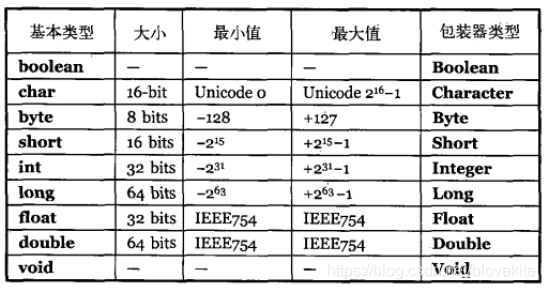

## 2.2.2 特例：基本类型

- 在程序设计中经常用到一系列类型，它们需要特殊对待。可以把它们想像成 “基本”类型。之所以特殊对待，是因为ner特对象存储在 “堆”里，故用new创建一个对象一—特别是小的、簡单的变量，往往不是很有效。因此，对于这些类型，Java采取与C和C++相同的方法。**也就是说，不用new来创建变量，而是创建一个并非是引用的“自动”变量。这个变量直接存储“值”，并置于堆栈中，因此更加高效。**

- Java要确定每种基本类型所占存储空间的大小。它们的大小井不像其他大多数语言那样随机器硬件架构的变化而变化。**这种所占存储空间大小的不变性是Java程序比用其他大多数语言编写的程序更具可移植性的原因之一**



- 所有数值类型都有正负号，所以不要去寻找无符号的数值类型。

- `boolean`类型所占存储空间的大小没有明确指定，仅定义为能够取字面值true或false。

- 基本类型具有的包装器类，使得可以在堆中创建一个非基本对象，用来表示对应的基本类型。例如

```java
char c='x'：
Character ch = new Character (c);
```

也可以这样用：

```java
Character ch = new Character ('x');
```

Java SES的自动包装功能将自动地将基本类型转换为包装器类型：

```java
Character ch ='x'：
```
**并可以反向转换：**

```java
char ca = ch;
```

包装基本类型的原因将在以后的章节中说明。

**高精度数字**

- Java提供了两个用于高精度计算的类：`Biginteger` 和`BigDecimal`。 虽然它们大体上展于 “包装器类”的范畴，但二者都没有对应的基本类型。

- 不过，这两个类包含的方法，提供的操作与对基本类型所能执行的操作相似。也就是说，**能作用于int 或noat的操作**，也同样能作用于`BigInteger`或 `BigDecimal`。只不过必须以方法调用方式取代运算符方式来实现。由于这么做复杂了许多，所以运算速度会比较慢。在这里，我们以速度换取了精度。

- `BigInteger`支持任意精度的整数。也就是说，在运算中，可以谁确地表示任何大小的整数值，而不会丟失任何信息。

- `BigDecimal`支持任何精度的定点数，例如，可以用它进行精确的货币计算。

## 小结
- 基本类型具有的包装器类，使得可以在堆中创建一个非基本对象，用来表示对应的基本类型
- Java提供了两个用于高精度计算的类：`Biginteger` 和`BigDecimal`。 虽然它们大体上展于 “包装器类”的范畴，但二者都没有对应的基本类型。
- `BigInteger`支持任意精度的整数。也就是说，在运算中，可以谁确地表示任何大小的整数值，而不会丟失任何信息。
- `BigDecimal`支持任何精度的定点数，例如，可以用它进行精确的货币计算。